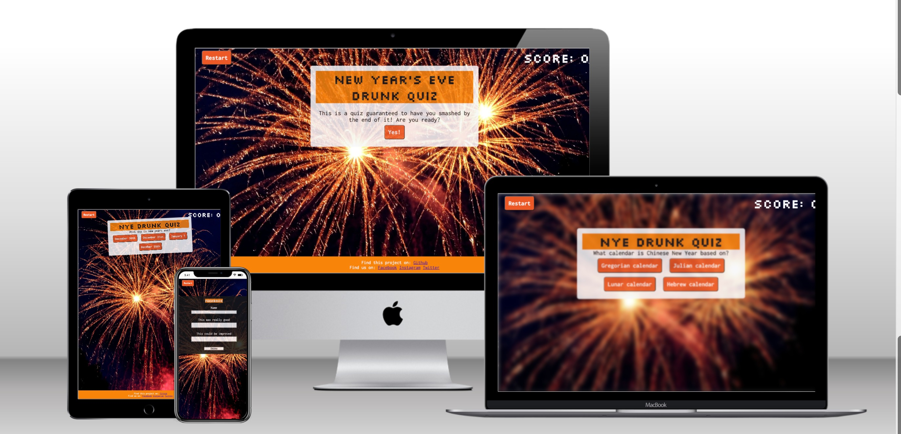
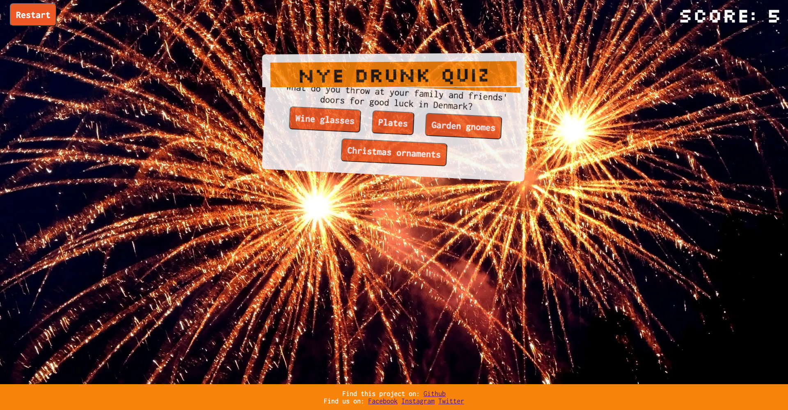
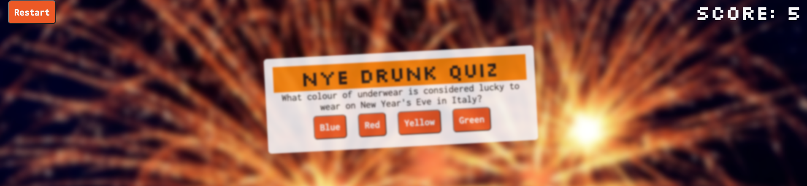
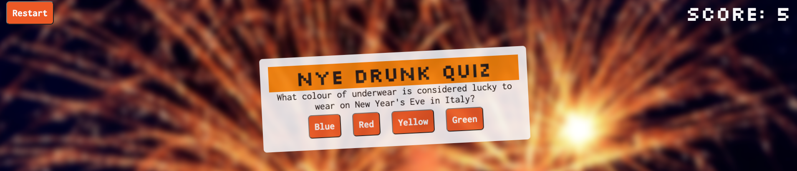
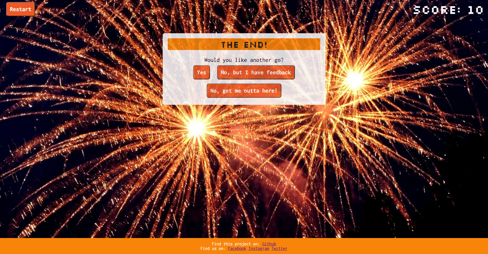
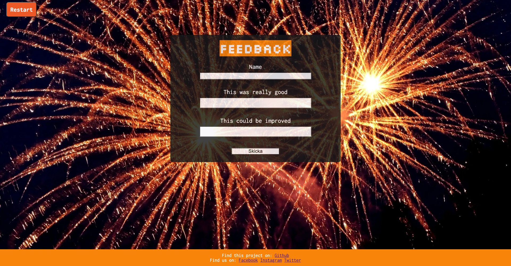
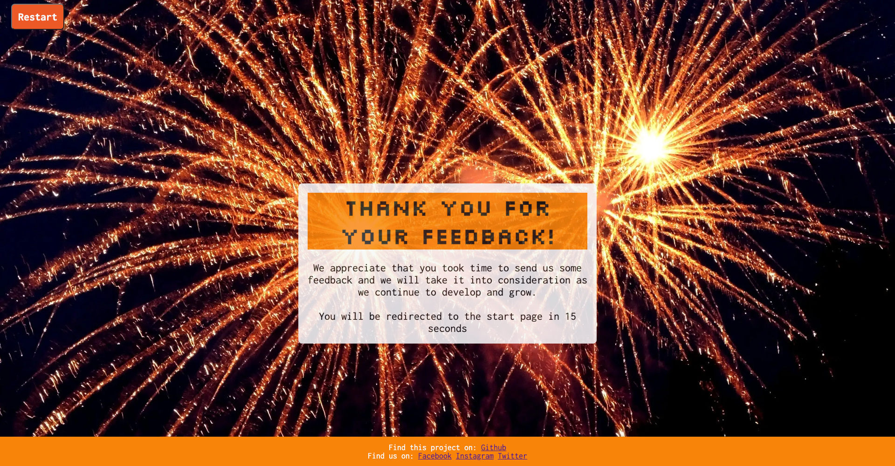
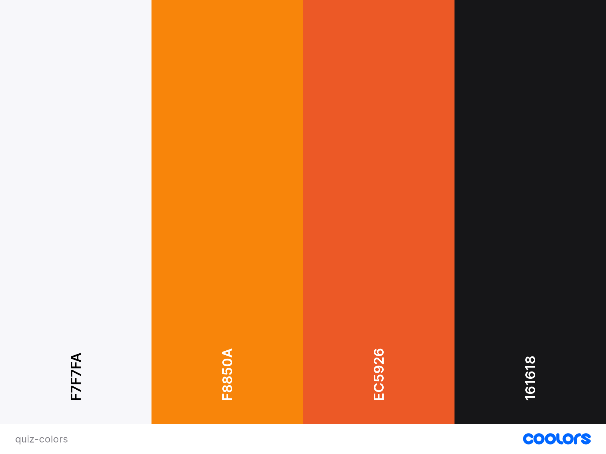
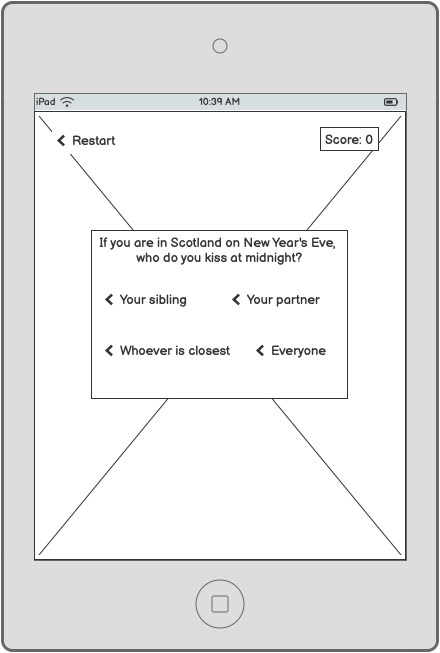

<h1 align="center">New Year's Eve Drunk Quiz</h1>

This is a quiz website for any New Year's Eve party where drinks are consumed (alcoholic or non-alcoholic). The aim of the game is to create some fun and as it is a drunk quiz, there are some features relating to that theme. These features include the rules that state that you should drink every time you answer a question incorrectly and each time you do click the incorrect answer, the page goes blurry.

The intended use for the quiz is for my New Year's Eve party so the quiz will be displayed on a big screen but then everyone will follow along and play on their own phones. This has affected some of the decisions on features when building the webpage.

[View live website here](https://e-tidemo.github.io/new-years-quiz/)

# Index - Table of Contents
* [User experience (UX)] (#user-experience-ux)
* [Features] (#features)
* [Design] (#design)
* [Technologies used] (#technologies-used)
* [Deployment] (#deployment)
* [Testing] (#testing)
* [Credits] (#credits)

- # User Experience (UX)
The overall goal was for the website to work on a range of different devices. Furthermore, considering the intended audience is a group of people I, myself, know in a New Year's party setting, the theme is a playful one and alcohol consumption need not to be problematised (as it might have should the quiz appeal to a different type of group, for example in a corporate setting).
  
  - ## 1. Goals for a First Time Visitor
    - For a first time visitor, it is important that one can quickly grasp what the website is about.
    - For a first time visitor, it is also of great importance that the rules of the game is clear.
    - For a first time visitor, it is important that the game is easy to navigate.
    - For a first time visitor, it is also important that one can restart the game in case one of the rules were missed or one accidently advances too fast.
  - ## 2. Goals for a Frequent Visitor
    - For a frequent visitor many of the goals are similar as for the first time visitor but for a frequent visitor it is important to get the game started easily and quickly.
    - For a returning or frequent visitor, it is also of value to be able to leave feedback about the quiz. This is also important for the future of the webpage as it can then continue to grow and improve the user experience further with the users' feedback.

- # Features
  - ## Existing Features
  - ### Header
    In the header one can see a score count that increases with each correct answer and also a restart button that will bring the player back to the start of the quiz.
    

  - ### Blur effect
    As the concept is a "drunk quiz", there is a feature that makes the text box wobble a little bit throughout the quiz. There is also an effect that blurs the background and an animation that makes the question box wobble quicker than before and blur the text for 4 seconds (before it becomes clear again) when the player answers a question wrong. This is to highlight the "punishment" of answering a question incorrectly which is to take a shot (found in the rules). Once the player answers another question correctly, the blur effect and animation disappears again and the text box goes back to wobbling a bit slower.
    
    

  - ### Play again?
    At the end of the quiz, the player is given three options - to play again, to leave feedback about the game or to leave the website. Leaving the website directs the player to google.com. If the player wants to leave some feedback on the game, they can click that button which will open a form in a different window and if the player chooses to play again they are redirected to the start page.
    

  - ### Footer
    In the footer, there are links to social media pages where one could, in theory, follow the quizmakers' pages. There is also a link to the github repository where the project is stored as this is a project that people can keep building on and developing further.
    

  - ### Feedback
    At the end of the quiz, the player is given a choice between three options and one of them is to submit feedback about the quiz. The form includes three text inputs: name, positive feedback and suggestions for improvements. When the submit button is clicked, the user is directed to a thank you page where they stay for 15 seconds before being redirected to the start page of the website.
    
    

  - ## Future Features
    The possibilities for improvements when it comes to an online quiz are endless but here are some realistic ideas that could improve this quiz further:

    - In the future, the quiz as a game would benefit a lot from having more questions and it displaying a random selection of these each round. That way one can play the game more times with more excitement. As it is now, one can replay the quiz until one finds all the correct answers but then it will become a bit boring and not very challenging.
    - Another future feature that would be neat is to have a timer for each question that gives you x amount of seconds to answer but as this quiz is intended to be used in a group, it was not applied this time around as it would have made the group following along in the same quiz a bit too complicated.

- # Design
  - ## Colour Scheme:
  
  The colour palette was inspired by the background image with the addition of white for contrast purposes so that the page will be as accessible as possible with sufficient contrasting colours.

  - ## Imagery
  
  The imagery for the background was chosen to fit the theme of New Year's Eve and I chose an image without text that would not distract from the contents of the quiz.

  - ## Typography
  Google fonts were used to import two different fonts:

   - Inconsolata - which was used for the paragraphs and questions
   - Silkscreen - which was used for all headings as well as the score

  The font for the headings was chosen to signal that the webpage is a game, as it is reminiscent of the early video games that were very pixelated.

  - ## Wireframes
  
  
  
  

  The final product is slightly different from the wireframes. There is, for example, no footer in the wireframes and the idea of having a feedback form appeared as I worked and was then added.

  - # Accessibility
    I have done the following to make sure that the website is as accessible as possible:
    - Used semantic HTML
    - Used contrasting colours throughout the website
    - Used descriptive alt attributes on any images
    - Provided information for screen readers about buttons and links to other websites etc.

- # Technologies Used
  - ## Language Used
    The languages used for this website are HTML, CSS and JavaScript.

  - ## Frameworks, Libraries and Programs Used
    [Balsamiq:](https://balsamiq.com/) was used to create wireframes
    
    [Pexels:](https://www.pexels.com/sv-se/) was used to find images for the styling of the webpage.

    [Google Fonts:](https://fonts.google.com/) was used to import the 'Inconsolata' and 'Silkscreen' fonts into the style.css file which are used on all pages of the project.

    [Git:](https://git-scm.com/) was used for version control by utilising the Gitpod terminal to commit to Git and Push to GitHub.

    [GitHub:](https://github.com/) is used as the respository for the projects code after being pushed from Git.

- # Deployment
    The website was deployed using github and the following instructions:
    
    1. In the GitHub repository, navigate to the Settings tab, then choose Pages from the left hand menu

    2. From the source section drop-down menu, select the Master Branch

    3. Once the master branch has been selected, the page will be automatically refreshed with a detailed ribbon display to indicate the successful deployment

    4. Any changes pushed to the master branch will take effect on the live project

    I have continuously used git as my local repository and github as my online repository. To do this, I have created a git repository and then, with any changes I have sent git commits to my local repository and, by using git push, I sent it to my github repository.

    The live website can be found here: [NYE Drunk Quiz](https://e-tidemo.github.io/new-years-quiz/)

- # Testing
   Testing was done throughout the project, not least with Chrome developer tools which was used to troubleshoot issues that would arise while building the website and to test the responsiveness of the website on different devices.

   I also tested the website in Google Chrome, Safari and Mozilla Firefox without any issues arising.

   - ## User experience testing

   - ## Credits
   - ### Code Used
  https://www.geeksforgeeks.org/how-to-perform-form-validation-for-a-required-field-in-html/ (How to make sure the form is not submitable without input)
  https://www.w3schools.com/tags/att_meta_http_equiv.asp (Thank you page)
  https://www.youtube.com/watch?v=f-lSGDjeHCk (How to blur)